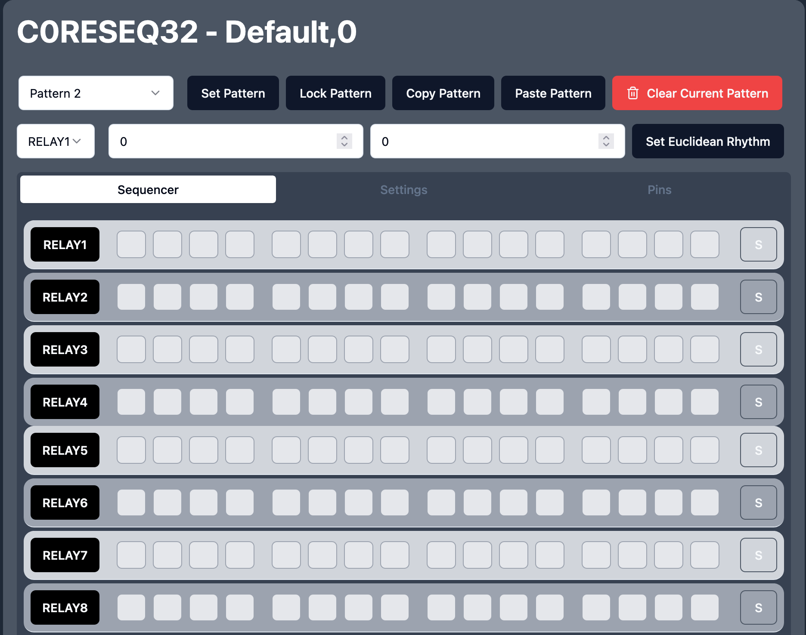

# C0R3SEQ32

C0R3SEQ32 is a powerful sequencer server implemented on the ESP32 platform. It offers precise timing control for 8 relays, a web interface for pattern editing, and persistent storage of patterns.

## Features

- Controls 8 relays in sequenced patterns
- Uses uClock for precise timing with 96 PPQN (Pulses Per Quarter Note) resolution
- Web interface built with React and shadcn/ui for pattern editing
- API for pattern manipulation
- Pattern storage in SPIFFS for persistence
- Tempo control and swing timing via uClock integration


## Installation Instructions

### 1. Set Up ESP32 Development Environment

1. Install the Arduino IDE from [arduino.cc](https://www.arduino.cc/en/software)
2. Add ESP32 board support:
   - Open Arduino IDE
   - Go to `File` > `Preferences`
   - In "Additional Boards Manager URLs" add:
     ```
     https://raw.githubusercontent.com/espressif/arduino-esp32/gh-pages/package_esp32_index.json
     ```
   - Go to `Tools` > `Board` > `Boards Manager`
   - Search for "esp32" and install "ESP32 by Espressif Systems"

### 2. Install Required Tools

1. Install ESP32 Filesystem Uploader:
   - Download [ESP32FS-1.0.zip](https://github.com/me-no-dev/arduino-esp32fs-plugin/releases/download/1.0/ESP32FS-1.0.zip)
   - Navigate to your Arduino tools directory:
     - Windows: `C:\Users\<username>\Documents\Arduino\tools\`
     - MacOS: `~/Documents/Arduino/tools/`
     - Linux: `~/Arduino/tools/`
   - Create a folder named `ESP32FS` and extract the ZIP contents into it
   - The final path should be: `<Arduino>/tools/ESP32FS/tool/esp32fs.jar`
   - Restart Arduino IDE

### 3. Install Required Libraries

Install these libraries using the Arduino Library Manager (`Sketch` > `Include Library` > `Manage Libraries...`):

- AsyncTCP by me-no-dev
- ESPAsyncWebServer by me-no-dev  
- uClock by midilab

Alternatively, download and install manually:

1. Download library ZIP files from the `libs` folder
2. In Arduino IDE: `Sketch` > `Include Library` > `Add .ZIP Library`
3. Select each downloaded ZIP file:
   - AsyncTCP-master.zip
   - ESPAsyncWebServer-master.zip 
   - uClock-2.1.0.zip

### 4. Verify Installation

1. Restart Arduino IDE
2. Select your ESP32 board: `Tools` > `Board` > `ESP32`
3. Verify ESP32FS tool appears: `Tools` > `ESP32 Sketch Data Upload`
4. Try compiling the sketch - all required libraries should be found